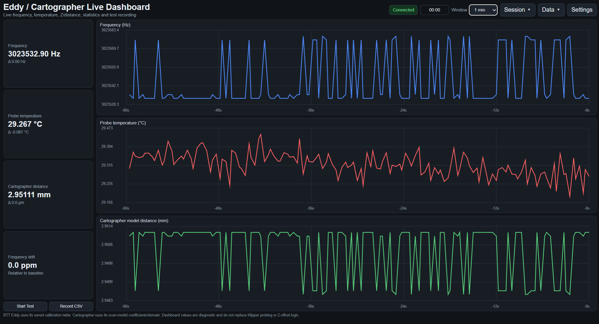

# Eddy / Cartographer Live Dashboard

A lightweight, read-only live dashboard for Klipper eddy-current probes.

The dashboard supports:

- BTT Eddy and other Klipper probes using the LDC1612 interface
- Cartographer V3 using the current Cartographer3D plugin

It provides live scrolling graphs for probe frequency, temperature, and Z/distance, along with baseline drift measurements and configurable probe settings.

The project is intended as a diagnostic and development tool for investigating:

- probe drift
- thermal behavior
- frequency stability
- repeatability
- sensor warm-up
- apparent Z movement
- Cartographer scan-model behavior
- effects of probe height or target interaction
- changes caused by different LDC drive-current settings

---

## Features

### Live data

- Live scrolling frequency graph
- Live probe temperature graph
- Live Z/distance graph
- Current frequency display
- Current probe temperature display
- Current Z/distance display
- Frequency drift in ppm
- Frequency change from baseline
- Temperature change from baseline
- Z change from baseline in microns
- Resettable baseline

### Graph windows

Selectable history windows:

- 1 minute
- 5 minutes
- 20 minutes
- 1 hour

### Probe support

#### BTT Eddy / Klipper LDC1612

- Uses Klipper's `ldc1612/dump_ldc1612` stream
- User-configurable Eddy sensor name
- Optional temperature probe name
- Paste-in Klipper `calibrate =` table
- Calculates calibration-equivalent Z by interpolation

#### Cartographer V3 / Cartographer3D Plugin

- Uses the Klipper `cartographer` status object
- Reads live:
  - frequency
  - temperature
  - sample time
  - raw sensor sample data
- Starts a Cartographer stream session automatically
- Uses the Cartographer scan model for frequency-to-distance conversion
- Accepts the `[cartographer scan_model default]` block directly
- Automatically stops/recycles its Cartographer stream session to avoid unbounded sample accumulation

### General

- User-configurable Moonraker host and port
- Automatic BTT Eddy / Cartographer probe detection
- Automatic BTT Eddy calibration discovery
- Automatic Cartographer scan-model discovery
- Configurable rolling sample averaging
- Configurable graph colors
- Start/stop CSV recording
- Download recorded CSV files from the browser
- Automatic test timer
- Live min/max/standard-deviation statistics
- Drift-rate statistics in Hz/min, ppm/min, and µm/min
- Recorded-run comparison
- Settings saved between restarts
- Automatically reconnects after interruptions
- Quiet terminal output with useful startup URL information
- Read-only with respect to normal printer operation
- No Klipper source modification required
- No firmware modification required
- No permanent printer configuration changes required

---

## Screenshot


---

# How it works

The dashboard runs as a small Flask web application on the Klipper host.

A typical data path looks like:

```text
Probe
  │
  ▼
Klipper
  │
  ▼
Moonraker
  │
  ▼
eddy_dashboard.py
  │
  ├── live frequency
  ├── probe temperature
  ├── calculated Z / Cartographer distance
  └── baseline drift statistics
  │
  ▼
Web browser
```

The dashboard itself does not command printer motion, heaters, probing, homing, or calibration.

---

# BTT Eddy mode

For BTT Eddy-style probes, the application connects to Klipper through Moonraker's Klipper socket and subscribes to:

```text
ldc1612/dump_ldc1612
```

Klipper returns LDC1612 sensor samples containing:

```text
time
frequency
z
```

The dashboard averages each incoming Klipper batch before plotting it.

This reduces browser load while still providing a smooth live graph.

Temperature is read separately from the configured Klipper:

```ini
[temperature_probe ...]
```

object.

---

# Cartographer V3 mode

The current Cartographer3D plugin is handled differently from BTT Eddy.

The dashboard reads the Klipper object:

```text
cartographer
```

and uses:

```text
cartographer.mcu.last_sample
```

The live Cartographer sample contains values such as:

```text
frequency
time
position
temperature
raw_count
```

Example Klipper/Moonraker object structure:

```text
cartographer
└── mcu
    └── last_sample
        ├── frequency
        ├── time
        ├── position
        ├── temperature
        └── raw_count
```

## Why the dashboard starts a Cartographer stream

The current Cartographer3D plugin does not continuously update `last_sample` while the sensor is idle.

To obtain continuously updating live data, the dashboard starts:

```text
CARTOGRAPHER_STREAM ACTION=START
```

through Moonraker.

When the dashboard stops or changes modes, it stops the stream with:

```text
CARTOGRAPHER_STREAM ACTION=STOP
```

The dashboard also periodically recycles the stream session.

This is intentional because Cartographer's diagnostic streaming session stores samples during the active session. Recycling the session prevents an indefinitely running dashboard from allowing that sample list to grow without limit.

---

# Requirements

A Klipper installation with:

- Klipper
- Moonraker
- Python 3
- network access to the printer

And one of:

### BTT Eddy / LDC1612

A probe using Klipper's:

```ini
[probe_eddy_current ...]
```

implementation with the LDC1612 diagnostic stream available.

### Cartographer V3

A Cartographer V3 running the current Cartographer3D plugin and exposing:

```text
cartographer
```

in Klipper's object list.

---

# Python packages

The dashboard requires:

```text
Flask
websocket-client
```

---

# Installation

SSH into the Klipper host.

Create a directory:

```bash
mkdir -p ~/eddy-dashboard
cd ~/eddy-dashboard
```

Create a virtual environment:

```bash
python3 -m venv venv
```

If the `venv` module is missing:

```bash
sudo apt update
sudo apt install python3-venv
```

Activate the environment:

```bash
source venv/bin/activate
```

Install dependencies:

```bash
pip install -r requirements.txt
```

Copy the dashboard script and requirements file into the directory:

```text
eddy_dashboard.py
requirements.txt
```

The directory should look similar to:

```text
~/eddy-dashboard/
├── eddy_dashboard.py
├── requirements.txt
└── venv/
```

---

# Running manually

Activate the environment:

```bash
cd ~/eddy-dashboard
source venv/bin/activate
```

Run:

```bash
python3 eddy_dashboard.py
```

You should see output similar to:

```text
Probe auto-detection: Detected Cartographer.
Using Cartographer scanner status stream
Using Cartographer object: cartographer

Eddy dashboard starting
  Port:       8085
  Local:      http://127.0.0.1:8085
  Network:    http://<printer-ip>:8085  <-- only shows if python3 eddy_dashboard.py --host 0.0.0.0 was used.
```

Normal Flask request logs are intentionally suppressed so the terminal stays readable. Meaningful connection, stream, and persistent error messages are still shown.

Open:

```text
http://127.0.0.1:8085
```

By default the dashboard binds to `127.0.0.1:8085` and is reachable only from
the machine it runs on. To allow access from other devices on your network:

```bash
python3 eddy_dashboard.py --host 0.0.0.0
```

Then open:

```text
http://PRINTER_IP:8085
```

For example:

```text
http://192.168.1.100:8085
```

If the printer hostname resolves locally, something like this may also work:

```text
http://voron:8085
```

## Security notes

This is a **diagnostic tool**, not a service. Run it manually when you need it
and stop it when you're done.

**The dashboard is unauthenticated by design.** There is no login. Access
control relies entirely on the fact that only local/private network clients are
accepted. Anyone who can reach the port can read live probe data, change the
configured Moonraker target, and start or stop CSV recordings.

**Do not place this dashboard behind a reverse proxy.** The local-only check
inspects the real TCP peer address and deliberately ignores `X-Forwarded-For`.
If nginx, Caddy, Traefik, or similar sits in front of it, every request appears
to originate from `127.0.0.1`, the local-only check passes for *all* clients
including those from the Internet, and the protection is silently defeated.
This matters in practice because Klipper hosts frequently already run nginx for
Mainsail or Fluidd -- do not add a proxy entry for this dashboard.

Only use `--host 0.0.0.0` on a network you trust.

---

# First-time setup

Open the dashboard and select **Settings**.

The Settings window can be closed using:

- the **Close** button
- the `Esc` key

## Auto detection

By default, the dashboard attempts to detect the installed probe automatically at startup.

It checks Klipper's loaded objects and can detect:

```text
cartographer
```

or:

```text
probe_eddy_current <name>
```

For BTT Eddy, it also attempts to detect:

- the Eddy sensor name
- a matching `temperature_probe`
- the saved `calibrate =` table

For Cartographer, it also attempts to detect:

- the `cartographer` status object
- the active scan model
- the saved Cartographer scan-model coefficients/domain

You can run detection manually at any time with:

```text
Settings → Auto Detect Now
```

Automatic detection can be disabled in Settings if you prefer to configure the probe manually.

---

# Probe type

Select the appropriate probe:

```text
BTT Eddy / Klipper LDC1612
```

or:

```text
Cartographer V3 / Cartographer3D
```

---

# Moonraker settings

## Moonraker host

If the dashboard runs on the same computer as Moonraker, use:

```text
127.0.0.1
```

## Moonraker port

The normal Moonraker port is:

```text
7125
```

---

# BTT Eddy configuration

When **BTT Eddy / Klipper LDC1612** is selected, configure the following.

## Eddy sensor name

Use the name after:

```ini
[probe_eddy_current ...]
```

For example:

```ini
[probe_eddy_current btt_eddy]
```

uses:

```text
btt_eddy
```

## Temperature probe name

Use the name after:

```ini
[temperature_probe ...]
```

For example:

```ini
[temperature_probe btt_eddy]
```

uses:

```text
btt_eddy
```

If there is no separate temperature probe object, leave this field blank.

---

# BTT Eddy calibration data

The calibration-equivalent Z graph uses the existing Klipper Eddy calibration table.

The dashboard can usually discover the saved `calibrate =` table automatically from Klipper.

If automatic discovery is unavailable or you want to override it manually, copy the `calibrate =` block from the `SAVE_CONFIG` section at the bottom of `printer.cfg`.

Example:

```ini
#*# [probe_eddy_current btt_eddy]
#*# reg_drive_current = 27
#*# calibrate =
#*#   0.050000:678437.389,0.090000:678275.407,0.130000:678111.331,
#*#   0.170000:677946.422,0.210000:677783.829,0.250000:677620.523,
#*#   0.290000:677460.811,0.330000:677298.268,0.370000:677139.817,
#*#   0.410000:676981.183,0.450000:676828.249,0.490000:676671.691
```

Paste the block directly into the dashboard.

The parser extracts pairs in the form:

```text
Z:frequency
```

For example:

```text
0.050000:678437.389
```

It ignores surrounding text such as:

```text
calibrate =
#*#
```

and line breaks.

---

# BTT Eddy calibration-equivalent Z

The dashboard converts the measured frequency into Z using linear interpolation between the saved calibration points.

The displayed value means:

> the Z position that corresponds to the current measured frequency according to the stored Klipper calibration.

It is useful for measuring apparent sensor drift.

It is not necessarily the true physical distance between the probe and the target.

This is especially important if the probe is outside the calibrated sensing range.

The dashboard deliberately does not extrapolate beyond the pasted calibration range.

If the current frequency is outside the calibration table, the dashboard displays:

```text
No distance
```

---

# Cartographer V3 configuration

When **Cartographer V3 / Cartographer3D** is selected, the BTT Eddy sensor-name and calibration fields are not required.

The dashboard reads Cartographer's live data from:

```text
cartographer.mcu.last_sample
```

---

# Cartographer scan model

The dashboard can usually discover the active Cartographer scan model automatically from Klipper.

If automatic discovery is unavailable or you want to override it manually, paste the complete scan-model block from `SAVE_CONFIG`.

Example:

```ini
#*# [cartographer scan_model default]
#*# coefficients = 1.4142270210736863,1.8858165705181558,0.8609574640872374,0.4194478576326323,0.35267133207875817,0.392660166158967,-0.10864201080375517,-0.22252968570372833,0.28264700523301084,0.22721290980476372
#*# domain = 3.190766648414659e-07,3.338151076700032e-07
#*# z_offset = 0
#*# reference_temperature = 28.82
#*# software_version = 1.9.0
#*# mcu_version = CARTOGRAPHER V3 6.1.0
```

The dashboard extracts:

```text
coefficients
domain
z_offset
reference_temperature
```

The important values used for distance conversion are:

```text
coefficients
domain
z_offset
```

---

# Cartographer model distance

Cartographer's scan model is a polynomial evaluated against inverse sensor frequency.

Conceptually:

```text
frequency
    │
    ▼
1 / frequency
    │
    ▼
Cartographer polynomial model
    │
    ▼
distance
```

The dashboard reproduces the scan-model polynomial from the pasted:

```text
coefficients =
domain =
```

data.

This allows the third graph to display Cartographer model distance rather than BTT-style calibration-equivalent Z.

---

# Cartographer temperature compensation

The Cartographer scan model includes:

```text
reference_temperature
```

However, Cartographer can also use a separate coil temperature-compensation calibration.

The current dashboard does **not** reproduce an optional separate Cartographer coil temperature-compensation curve.

If no additional coil compensation model is configured, the scan-model conversion is sufficient.

If a separate temperature-compensation model is active, there may be a difference between the dashboard's calculated distance and Cartographer's internally compensated result.

---

# Reset baseline

The **Reset baseline** button stores the current values as the reference.

After resetting:

```text
Frequency change   = 0 Hz
Temperature change = 0 °C
Z change           = 0 µm
Frequency drift    = 0 ppm
```

This does not change anything in Klipper.

It only changes the dashboard's reference values.

This is useful when comparing:

- probe warm-up
- different probe heights
- different target materials
- bed-temperature changes
- sensor-temperature changes
- different `reg_drive_current` values
- electronics changes
- long-duration drift

---

# Frequency drift in ppm

Frequency drift is shown in parts per million:

```text
ppm =
(current_frequency - baseline_frequency)
----------------------------------------
          baseline_frequency

× 1,000,000
```

Equivalent formula:

```text
ppm = Δfrequency / baseline_frequency × 1,000,000
```

For example:

```text
Baseline frequency = 675000 Hz
Frequency change   = +337.5 Hz
```

gives:

```text
+500 ppm
```

Using ppm makes it easier to compare drift at different absolute sensor frequencies.

---

# Graph layout

The desktop layout is designed to fit on one browser screen.

The four live values are shown in a column on the left:

```text
Frequency
Probe temperature
Z / Cartographer distance
Frequency drift
```

The right side contains three separate scrolling graph rows:

```text
Frequency
Temperature
Z / distance
```

The dashboard automatically falls back to a stacked layout on smaller screens.

---

# Graph windows

Available windows:

```text
1 minute
5 minutes
20 minutes
1 hour
```

The graphs continuously scroll as new samples arrive.

Recent samples are kept in memory so switching the graph window can display earlier samples from the current session.

---

# Session menu

The **Session** menu contains the controls used during a drift or stability test.

Available actions include:

- Start test
- Stop test
- Reset timer
- Reset baseline
- Start CSV recording
- Stop CSV recording
- Download last CSV

The dashboard also provides quick **Start Test** and **Record CSV** buttons beside the live-value cards.

---

# Automatic test timer

Starting a test:

```text
Session → Start test
```

does two things:

1. resets the current measurement baseline
2. starts the elapsed test timer

Stopping a test freezes the timer.

Resetting the timer clears the test time without affecting the probe or printer.

The timer is displayed in the top toolbar.

---

# CSV recording

Start a recording with:

```text
Session → Start CSV recording
```

You can optionally enter a recording label.

Recorded files are stored in:

```text
~/eddy-dashboard/recordings/
```

Each CSV contains:

```text
wall_time_iso
wall_time_unix
sensor_time
frequency_hz
temperature_c
z_or_distance_mm
probe_type
```

CSV recording uses the dashboard's configured rolling-average output, not every raw MCU sample.

Stop recording with:

```text
Session → Stop CSV recording
```

The most recently completed recording can be downloaded with:

```text
Session → Download last CSV
```

Recorded files can also be downloaded from the Recorded Runs window.

---

# Live statistics

Open:

```text
Data → Statistics
```

Statistics are calculated over the currently selected graph window.

For frequency, the dashboard displays:

- minimum
- maximum
- standard deviation
- drift rate in Hz/min
- drift rate in ppm/min

For temperature:

- minimum
- maximum
- standard deviation

For Z / Cartographer distance:

- minimum
- maximum
- standard deviation
- drift rate in µm/min

The drift rates are calculated using a linear least-squares fit over the displayed samples.

---

# Recorded-run comparison

Open:

```text
Data → Recorded runs / Compare
```

The dashboard lists saved CSV recordings and allows multiple runs to be selected.

Comparison options include:

```text
Frequency Δ (Hz)
Frequency drift (ppm)
Z/distance Δ (µm)
Temperature Δ (°C)
```

Each run is normalized to its own starting value and plotted against elapsed time.

This makes it easier to compare tests such as:

- different probe heights
- cold-start vs warmed-up behavior
- different bed temperatures
- different target materials
- different BTT Eddy drive-current values
- hardware or electronics changes

Up to several runs can be displayed together.

---

# Sample averaging

The dashboard supports configurable rolling sample averaging.

Open:

```text
Settings → Rolling sample average
```

The allowed range is:

```text
1 to 200 samples
```

A value of:

```text
1
```

disables additional dashboard-side averaging.

Higher values smooth short-term noise but also reduce responsiveness to fast changes.

CSV recordings and graph points use the averaged values.

---

# Graph colors

Frequency, temperature, and Z/distance graph colors can be changed from Settings.

Available configurable colors are:

- Frequency graph
- Temperature graph
- Z/distance graph

The selected colors are saved in `eddy_dashboard_config.json`.

---

# Interface overview

The main dashboard is intentionally kept simple.

The top toolbar contains:

```text
Connection status
Recording status
Test timer
Graph window
Session menu
Data menu
Settings
```

The **Session** menu contains test and recording controls.

The **Data** menu contains statistics and recorded-run comparison.

The **Settings** dialog contains connection settings, automatic detection, averaging, graph colors, and manual calibration/model overrides.

This keeps the live monitoring view uncluttered while still exposing the more advanced diagnostic tools when needed.

---

# Automatic startup with systemd

After confirming the dashboard works manually, create:

```bash
sudo nano /etc/systemd/system/eddy-dashboard.service
```

Example:

```ini
[Unit]
Description=Eddy / Cartographer Live Dashboard
After=network.target klipper.service moonraker.service
Wants=klipper.service moonraker.service

[Service]
Type=simple
User=voron
WorkingDirectory=/home/voron/eddy-dashboard
ExecStart=/home/voron/eddy-dashboard/venv/bin/python /home/voron/eddy-dashboard/eddy_dashboard.py
Restart=always
RestartSec=3

[Install]
WantedBy=multi-user.target
```

Change:

```text
User=voron
```

and:

```text
/home/voron/
```

if your Klipper host uses a different username.

Reload systemd:

```bash
sudo systemctl daemon-reload
```

Enable and start:

```bash
sudo systemctl enable --now eddy-dashboard
```

Check status:

```bash
systemctl status eddy-dashboard --no-pager
```

View live logs:

```bash
journalctl -u eddy-dashboard -f
```

Restart after updating:

```bash
sudo systemctl restart eddy-dashboard
```

---

# Configuration storage

Settings are saved in:

```text
eddy_dashboard_config.json
```

in the same directory as the script.

Example:

```text
~/eddy-dashboard/
├── eddy_dashboard.py
├── eddy_dashboard_config.json
├── recordings/
│   └── YYYYMMDD_HHMMSS_test-name.csv
└── venv/
```

The file is created automatically after saving Settings.

---

# Troubleshooting

## Dashboard says Disconnected

Confirm Moonraker is running:

```bash
systemctl status moonraker
```

Check the configured host and port.

For a dashboard running on the Klipper host, the usual values are:

```text
Host: 127.0.0.1
Port: 7125
```

---

## BTT Eddy: `ldc1612/dump_ldc1612` not found

If the terminal shows:

```text
No registered callback for path 'ldc1612/dump_ldc1612'
```

the configured probe is not exposing Klipper's LDC1612 dump endpoint.

This is expected when using Cartographer.

Switch the dashboard Probe Type to:

```text
Cartographer V3 / Cartographer3D
```

---

## Cartographer: `scanner/dump` not found

Older Cartographer implementations used different interfaces.

The current Cartographer3D plugin does not require:

```text
scanner/dump
```

The dashboard instead reads:

```text
cartographer
```

from Klipper's object status.

To verify the object exists:

```bash
curl -s http://localhost:7125/printer/objects/list \
  | python3 -m json.tool \
  | grep -i cartographer -C 2
```

You should see entries similar to:

```text
mcu cartographer
temperature_sensor cartographer_coil
cartographer
temperature_sensor cartographer
```

---

## Verify Cartographer live data manually

Run:

```bash
curl -s 'http://localhost:7125/printer/objects/query?cartographer' \
  | python3 -m json.tool
```

A working installation should contain something similar to:

```json
{
    "cartographer": {
        "mcu": {
            "last_sample": {
                "frequency": 2972395.24,
                "time": 145372.78,
                "temperature": 32.44,
                "raw_count": 33245678
            }
        }
    }
}
```

---

## Cartographer frequency is visible but not changing

The Cartographer plugin normally stops continuous MCU sampling while idle.

The dashboard automatically starts:

```text
CARTOGRAPHER_STREAM ACTION=START
```

If the stream cannot be started, check the dashboard terminal output or:

```bash
journalctl -u eddy-dashboard -f
```

---

## Cartographer distance says `No distance`

Possible causes:

- no Cartographer scan model has been pasted
- the model block could not be parsed
- the current inverse frequency is outside the model's domain
- the wrong scan model was pasted

Paste the full:

```text
[cartographer scan_model default]
```

block into Settings.

---

## BTT Eddy temperature is blank

Verify that Klipper has a matching:

```ini
[temperature_probe ...]
```

object.

If no separate temperature probe exists, leave the field blank.

---

## Cartographer temperature

Cartographer temperature comes directly from:

```text
cartographer.mcu.last_sample.temperature
```

No separate temperature-probe name is required in Cartographer mode.

---

## BTT Eddy calibration data is rejected

At least two valid calibration pairs are required.

A valid pair looks like:

```text
0.050000:678437.389
```

Paste the entire `calibrate =` block directly from `printer.cfg`.

---

## Cartographer says `Stream is already active`

If a previous dashboard process was terminated before it could stop the Cartographer stream, Cartographer may report:

```text
Stream is already active
```

The current dashboard attempts to recover automatically by sending:

```text
CARTOGRAPHER_STREAM ACTION=STOP
```

and then starting a new stream.

If recovery does not work, manually run:

```text
CARTOGRAPHER_STREAM ACTION=STOP
```

from the Klipper console and restart the dashboard.

---

## Occasional Cartographer timeout messages

A single Moonraker/Cartographer status timeout can occur while Klipper is briefly busy.

The dashboard suppresses isolated timeouts and only reports the problem in the terminal if read failures persist.

---

## Port 8085 is already in use

Check:

```bash
sudo ss -ltnp | grep 8085
```

Stop the conflicting process or change the dashboard web port.

---

# Security

The dashboard is intended for use on a trusted local network.

By default it listens on:

```text
0.0.0.0:8085
```

which makes it accessible to devices on the LAN.

There is currently no built-in authentication.

Do not expose port `8085` directly to the public Internet.

---

# Does this modify Klipper?

The dashboard does not modify:

- `printer.cfg`
- Klipper source
- firmware
- probe calibration
- Z offset
- `reg_drive_current`
- MCU configuration
- printer motion
- heater state

In BTT Eddy mode, operation is read-only.

In Cartographer mode, the dashboard additionally starts and stops the plugin's diagnostic stream using:

```text
CARTOGRAPHER_STREAM ACTION=START
CARTOGRAPHER_STREAM ACTION=STOP
```

This is required to keep Cartographer's live MCU sample updating while the printer is idle.

It does not perform probing, homing, calibration, or motion.

---

# Performance

LDC-based probes can produce data at a high sample rate.

For BTT Eddy, the dashboard averages each incoming Klipper data batch before displaying it.

For Cartographer, the dashboard reads the most recent MCU sample through the Klipper status object and only adds a graph point when the sample timestamp changes.

The browser therefore receives a much smaller data set than the probe's raw internal sampling rate.

---

# Known limitations

- BTT Eddy requires the `ldc1612/dump_ldc1612` endpoint.
- BTT Z conversion is only valid inside the discovered/pasted calibration range.
- Cartographer requires the current `cartographer` Klipper status object.
- Cartographer model distance requires a discovered or pasted scan model.
- Optional separate Cartographer coil temperature-compensation calibration is not currently reproduced.
- Probe/calibration/model auto-detection depends on the relevant Klipper objects and config data being exposed through Moonraker.
- No built-in authentication.
- Live graph history is stored in RAM only.
- Restarting the dashboard clears live graph history.
- Recorded CSV files are persistent until manually deleted.
- Recorded-run comparison currently operates on dashboard-generated CSV files.

---

# Updating

Replace:

```text
eddy_dashboard.py
```

with the new version.

If using systemd:

```bash
sudo systemctl restart eddy-dashboard
```

If running manually:

```bash
cd ~/eddy-dashboard
source venv/bin/activate
python3 eddy_dashboard.py
```

---

# Removing

Disable the service:

```bash
sudo systemctl disable --now eddy-dashboard
```

Remove the service:

```bash
sudo rm /etc/systemd/system/eddy-dashboard.service
sudo systemctl daemon-reload
```

Remove the application directory if desired:

```bash
rm -rf ~/eddy-dashboard
```

---

# Disclaimer

This project is a diagnostic tool.

Always verify probe behavior using the normal Klipper and probe-manufacturer calibration/setup procedures before relying on measurements for printer operation.

Do not use the dashboard's calculated Z or Cartographer model-distance value as a replacement for Klipper's normal:

- homing
- probing
- Z-offset handling
- bed leveling
- safety logic

---
